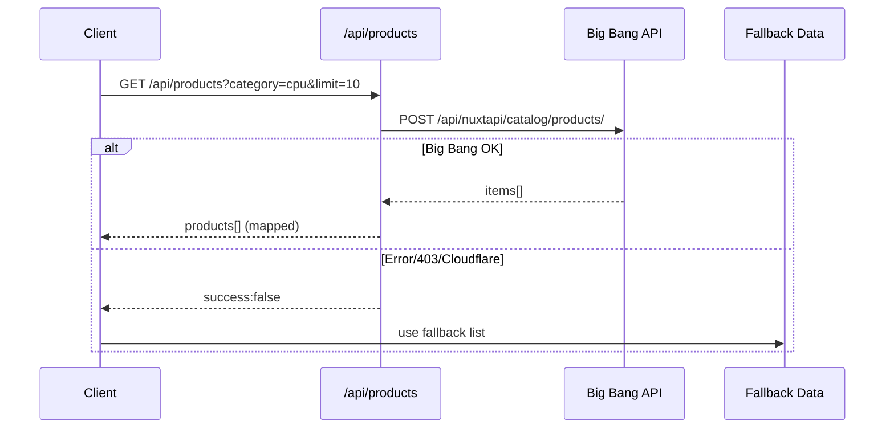

# 🖥️ PC Builder — Profesionalna dokumentacija

Web aplikacija za sastavljanje računara uz provjeru kompatibilnosti, pametne preporuke i integraciju sa Big Bang katalogom za proizvode i cijene. Fokus je na brzom UX-u, jasnoj strukturi i stabilnim fallback podacima kada vanjski servis nije dostupan.

---

## ✨ Ključne mogućnosti

- 🤖 **AI konfiguracija** (automatski prijedlozi komponenti)
- 🔧 **Ručni odabir** komponenti uz kompatibilnost
- 💰 **Budžet tracking** u realnom vremenu
- 🔄 **Zamjena dijelova** bez resetiranja ostalih komponenti
- 📊 **Validacija kompatibilnosti**
- 🔗 **Dijeljenje konfiguracija** putem linka
- 🛒 **Shop** sa pretragom i filtriranjem
- 🧠 **Forum** s ticketima, komentarima i ratingom

---

## 🧱 Tech Stack

- **Next.js 14** (App Router)
- **TypeScript**
- **NextAuth v5** (auth)
- **Prisma + PostgreSQL (Neon)**
- **Resend** (email verifikacija)
- **Groq API** (AI chat)
- **Big Bang API** (katalog proizvoda)

---

## 🧭 Arhitektura sistema (visoki nivo)

```mermaid
flowchart TB
  U[User Browser] --> FE[Next.js App Router UI]
  FE -->|fetch| API[Next.js API Routes]
  API --> DB[(PostgreSQL via Prisma)]
  API --> AUTH[NextAuth Auth]
  API --> GROQ[Groq AI]
  API --> RESEND[Resend Email]
  API --> BB[Big Bang API]

  BB -. fallback .-> FB[Local Fallback Products]
  FE <-- API
```

---

## 🔁 Tok proizvoda (Shop/Builder)



---

## 🗃️ Glavni moduli

- **Builder**: odabir dijelova, kompatibilnost, budžet
- **Shop**: pregled i filter proizvoda po kategoriji
- **Forum**: ticketi, komentari, rating, clap
- **Setups**: upload i prikaz konfiguracija
- **Auth**: registracija, prijava, email verifikacija

---

## 🗄️ Modeli baze (sažetak)

- **User** — korisnici
- **Ticket** — forum teme (rating/claps)
- **Message** — komentari na ticketima
- **Setup** — korisničke konfiguracije
- **SetupComment** — komentari na setup
- **MessageReaction / SetupCommentReaction** — like/dislike (1 po korisniku)
- **MessageRating / SetupCommentRating** — rating (1 po korisniku)
- **TicketRating / TicketClap** — rating/clap (1 po korisniku)

---

## ⚙️ Instalacija (lokalno)

### Preduvjeti
- Node.js 18+
- npm
- PostgreSQL (ili Neon)

### Koraci

```bash
git clone https://github.com/Cirkquaza/pc-builder.git
cd pc-builder
npm install
cp .env.example .env.local
npm run dev
```

App je dostupna na http://localhost:3000

---

## 🔐 Environment varijable

| Varijabla | Opis |
|---|---|
| DATABASE_URL | Prisma/PostgreSQL konekcija |
| NEXTAUTH_SECRET | NextAuth secret |
| RESEND_API_KEY | Resend email ključ |
| GROQ_API_KEY | Groq API ključ |
| NEXTAUTH_URL | Base URL aplikacije |
| RESEND_FROM | Verificirani sender (npr. no-reply@yourdomain.com) |

---

## 📦 Skripte

```bash
npm run dev      # lokalni dev
npm run build    # produkcijski build
npm run start    # produkcijski server
npm run lint     # lint
```

---

## 🚀 Deployment

- Preporuka: **Vercel**
- Automatski deploy na `git push` u main
- `.env` fajl **nikad** ne smije biti u git-u

---

## 🧩 Big Bang integracija (važno)

Big Bang API je zaštićen Cloudflare-om. Direktni pozivi iz browsera su blokirani (CORS). Zato se koristi **server-side** API ruta koja pokušava fetch i vraća fallback kada Big Bang blokira.

Ako želite **100% live** podatke bez fallbacka, potrebna je:

1. **Partner API pristup** od Big Bang-a, ili
2. **Proxy servis** (npr. Cloudflare Worker) koji preuzima podatke i prosljeđuje ih aplikaciji.

### ✅ Cloudflare Worker proxy (preporučeno)

U ovom repozitoriju postoji worker:

- [workers/bigbang-proxy.js](workers/bigbang-proxy.js)

**Koraci:**

1. Instaliraj Wrangler CLI
2. Deployaj worker (novi project)
3. Postavi `PROXY_TOKEN` (optional) u worker env
4. U `.env.local` dodaj:

```
BIGBANG_PROXY_URL=https://your-worker.your-subdomain.workers.dev
BIGBANG_PROXY_TOKEN=your_proxy_token
```

Nakon toga, `/api/products` koristi proxy i vraća live podatke.

---

## 🛠️ Troubleshooting

**1) CORS greške u browseru**
- Ne pozivati Big Bang API direktno iz browsera.

**2) 403/Cloudflare**
- Fallback se aktivira automatski.

**3) Resend ne šalje na sve adrese**
- U Resend dashboardu verifikuj domain i postavi `RESEND_FROM` na taj domain.

**3) Prisma error**
- Provjeriti `DATABASE_URL` i pokrenuti `npx prisma db push`.

---

## ✅ Status projekta

- Stabilan build
- Fallback sistem aktivan
- Forum, auth i setupi funkcionalni

---

Ako želiš **pravi live katalog bez fallbacka**, mogu odmah napraviti Cloudflare Worker proxy i povezati ga u app.# 🖥️ PC Builder - Konfiguracija Računara

Aplikacija za jednostavno i brzo sastavljanje računara sa provjerom kompatibilnosti komponenti, automatskim preporukama i mogućnosti dijeljenja konfiguracija. Integrirana sa **Big Bang** za live cijene i dostupnost komponenti.

## ✨ Karakteristike

- 🤖 **Automatska konfiguracija** - AI pomaže da odabere najbolje komponente
- 🔧 **Ručni odabir** - Potpuna kontrola nad svakom komponentom
- 💰 **Budžet kontrola** - Prate se troškovi u realnom vremenu
- 🔄 **Zamjena komponenti** - Lako zamijenite samo dio bez resetiranja
- 📊 **Kompatibilnost** - Automatska provjera kompatibilnosti
- 🔗 **Share linkovi** - Podijelite konfiguraciju sa prijateljima
- 📱 **Responzivni dizajn** - Radi na svim uređajima
- 🛒 **Big Bang integracija** - Live proizvodi, cijene i kupovnja direktno sa Big Banga
- 🏪 **Online shop** - Pretražite i kupite komponente iz jednog mjesta

## 🚀 Brzi Start

### Zahtjevi
- Node.js 18+ 
- npm ili yarn

### Instalacija

```bash
# Kloniraj repozitorij
git clone https://github.com/Cirkquaza/pc-builder.git
cd pc-builder

# Instaliraj zavisnosti
npm install

# Kreiraj .env.local datoteku (pogledaj .env.example)
cp .env.example .env.local

# Pokreni development server
npm run dev
```

Stranica će biti dostupna na **http://localhost:3000**

---

## 🏗️ Arhitektura Aplikacije

### Dijagram toka podataka

```
┌─────────────────────────────────────────────────────────────────────┐
│                        KLIJENT (Next.js Frontend)                  │
├─────────────────────────────────────────────────────────────────────┤
│                                                                       │
│  ┌──────────────────┐  ┌──────────────────┐  ┌──────────────────┐ │
│  │   Početna (/）    │  │  Builder (/      │  │  Shop (/shop)    │ │
│  │   - Home         │  │  /builder)       │  │  - Pretraga      │ │
│  │   - Gumbi za     │  │  - Aut Build     │  │  - Grid kartice  │ │
│  │     Počni/Shop   │  │  - Manual Select │  │  - "Kupi" gumbi  │ │
│  └────────┬─────────┘  └────────┬─────────┘  └────────┬─────────┘ │
│           │                      │                      │            │
│           └──────────────────────┼──────────────────────┘            │
│                                  │                                   │
│                          ProductsLoader                             │
│                    (čita iz /api/products)                          │
│                                  │                                   │
└──────────────────────────────────┼───────────────────────────────────┘
                                   │ (HTTP GET request)
                    ┌──────────────▼──────────────┐
                    │   NAŠI API ROUTE HANDLERI   │
                    │    (Next.js /api folder)    │
                    └──────────────┬──────────────┘
                                   │
                    ┌──────────────▼──────────────┐
                    │  /api/products?category=cpu │
                    │  - Mapira kategoriju na ID  │
                    │  - Zove Big Bang API        │
                    │  - Mapira polja (url, cijena)
                    │  - Vraća JSON: {products[]} │
                    │  - Cache: 5 min revalidate  │
                    └──────────────┬──────────────┘
                                   │
                                   │ (3 grane)
                    ┌──────────────┴───────────────┬──────────────┐
                    │                              │              │
          ✅ BIG BANG API OK           ❌ BIG BANG 403        Fallback
         (API dostupna, live)      (Auth/CORS/rate limit)   (local data)
                    │                              │              │
        ┌───────────▼──────────┐      ┌───────────▼──────┐    │
        │ BigBang Nuxt API     │      │ Fallback Products│    │
        │ POST /api/nuxtapi/   │      │ - Hardcoded liste│    │
        │ catalog/products/    │      │ - Big Bang search│    │
        │                      │      │   linkovi        │    │
        │ ✓ url_without_domain │      │                  │    │
        │ ✓ price              │      │ {id, name, brand,│    │
        │ ✓ discount_percent   │      │  price, url...} │    │
        │ ✓ image              │      └──────────────────┘    │
        │ ✓ manufacturer_title │                              │
        │ ✓ available_qty      │                              │
        └──────────┬───────────┘                              │
                   │                                          │
        ┌──────────▼──────────────────────────────────────────┘
        │
    Mapiranje na Component format:
    {id, name, brand, price, finalPrice,
     url, image, category, stock,
     specs, link, reason}
        │
    ┌───▼────────────────────────────────────┐
    │  Klijent dobije proizvode              │
    │  Prikaže u /builder ili /shop          │
    │  Gumb "Kupi na Big Bang" koristi       │
    │  - URL iz API-ja ili                   │
    │  - Search link iz fallbacka            │
    │  → Otvori https://www.bigbang.hr/...   │
    └───────────────────────────────────────┘
```

### Detaljno objašnjenje

**1. Kako se učitavaju proizvodi?**
- Kada otvoriš `/builder` ili `/shop`, komponenta `ProductsLoader` pokreće zahtjeve prema `/api/products?category=cpu&limit=10` itd. za svaku kategoriju.

**2. Kada je API dostupan (bez 403)?**
- `/api/products` šalje POST na `https://www.bigbang.hr/api/nuxtapi/catalog/products/` sa payloadom:
  ```json
  {
    "mode": "widget",
    "related_widget_data": { "category_id": "593" },
    "only_available": true,
    "limit": 10,
    "response_fields": ["id", "title", "basic_price_custom", "url_without_domain", ...],
    "lang": "hr"
  }
  ```
- Odgovor mapira Big Bang polja na `Component` format (cijena, URL, slika, dostupnost).

**3. Kada Big Bang API vrati 403 (auth/CORS blokada)?**
- Nema problema! `ProductsLoader` hvata grešku i koristi **fallback podatke** — lokalno definirane proizvode sa Big Bang search URL-ovima.
- Gumb "Kupi na Big Bang" i dalje funkcionira, samo sa search linkovima umjesto direktnih proizvoda.

**4. Gdje su hardcoded podaci?**
- **Hardcoded fallback**: `src/app/builder/ProductsLoader.tsx` → funkcija `getFallbackProducts()` sadrži lokalne CPU/GPU/RAM/… proizvode sa Big Bang search linkovima za slučaj kad API ne radi.
- **Live podaci**: Dolaze iz Big Bang API-ja (ako je dostupan) — nisu hardcoded, generiraju se kada otvoriš builder.

**5. Tok kada korisnik klikne "Kupi na Big Bang"?**
```
Korisnik odabere e.g. "Gigabyte B650 AORUS Elite"
         ↓
Button sadrži: url = "https://www.bigbang.hr/products/..." (iz API-ja)
         ↓
onclick → otvori tab sa tim URL-om
         ↓
Korisnik je na Big Bang stranici tog proizvoda → može dodati u košaricu
```

---

## 📁 Struktura Projekta

```
src/
├── app/
│   ├── api/
│   │   ├── products/          # GET /api/products?category=cpu
│   │   │   └── route.ts       # Čita Big Bang API ili vraća fallback
│   │   └── check-availability/  # GET /api/check-availability (drugi shopovi)
│   ├── builder/               # Stranica za gradnju PC-a
│   │   ├── page.tsx           # Main builder UI
│   │   ├── ProductsLoader.tsx # Komponenta za učitavanje proizvoda
│   │   └── useProducts.ts     # Hook za dohvat i transformaciju
│   ├── shop/                  # Online kupovina stranica
│   │   └── page.tsx           # Grid proizvoda sa search filterom
│   ├── page.tsx               # Početna stranica
│   └── layout.tsx             # Root layout
└── public/                    # Static assets
```

---

## 🔧 API Endpointi

### GET `/api/products`
Dohvaća proizvode iz Big Banga ili fallbacka.

**Query parametri:**
- `category` (string): `cpu`, `gpu`, `ram`, `motherboard`, `storage`, `psu`, `case`
- `limit` (number): broj proizvoda, default 10
- `minPrice` (number): opcionalno
- `maxPrice` (number): opcionalno

**Odgovor:**
```json
{
  "success": true,
  "category": "cpu",
  "count": 10,
  "products": [
    {
      "id": "123",
      "name": "Ryzen 5 5600",
      "brand": "AMD",
      "price": 139,
      "finalPrice": 139,
      "url": "https://www.bigbang.hr/products/...",
      "image": "https://www.bigbang.hr/...",
      "category": "CPU",
      "inStock": true,
      "stock": 5,
      "discount": 0,
      "description": "..."
    }
  ]
}
```

---

## 🔧 Environment Varijable

Pogledaj `.env.example` za sve dostupne varijable. Za lokalni razvoj:

```env
NODE_ENV=development
NEXT_PUBLIC_APP_URL=http://localhost:3000
```

### Za Vercel Deployment

Dodaj ove varijable u Vercel project settings:
```
NEXT_PUBLIC_APP_URL=https://your-domain.com
```

---

## ⚙️ Big Bang Integracija

### Trenutno stanje (Januar 2025)

- ✅ **API endpoint mapiran**: Nuxt API `POST /api/nuxtapi/catalog/products/`
- ✅ **Fallback data**: Lokalni proizvodi sa Big Bang search linkovima
- ✅ **UI gotov**: Builder i Shop stranice sa "Kupi" gumbima
- ❌ **Live API dostupan**: Trenutno vraća 403 (auth/CORS), koristi se fallback

### Kako poboljšati (ToDo)

1. **Proxy ili partner API**: Kontaktirati Big Bang za:
   - Zvaničan API ključ ili
   - Proxy koji prosleđuje zahtjeve s klijentskog user-agenta

2. **Alternativa**: Koristiti Playwright/Puppeteer backend za scraping (ali sporije)

3. **Kada Big Bang API bude dostupan**:
   - Automatski će se učitati live cijene i dostupnost
   - Gumbovi "Kupi na Big Bang" će voditi direktno na proizvode (umjesto search linkova)
   - Pretraga će biti brža i preciznija

### Konfiguracija

Big Bang category mapiranje (`src/app/api/products/route.ts`):

```typescript
const CATEGORY_MAP: Record<string, string> = {
  cpu: '593',
  gpu: '594',
  ram: '595',
  motherboard: '592',
  ssd: '597',
  hdd: '598',
  case: '599',
  psu: '600',
  cooling: '601',
};
```

Payload koji se šalje (prilagodi ako je potrebno):
```json
{
  "mode": "widget",
  "related_widget_data": { "category_id": "593" },
  "only_available": true,
  "limit": 10,
  "always_to_limit": true,
  "response_fields": [
    "id", "title", "basic_price_custom", "discount_percent_custom",
    "url_without_domain", "main_image_upload_path", "manufacturer_title",
    "category_title", "available_qty", "short_description"
  ],
  "lang": "hr"
}
```

---

## 📊 Build za produkciju

```bash
npm run build
npm run start
```

## 📦 Tech Stack

- **Framework**: Next.js 14
- **Styling**: Tailwind CSS
- **Animations**: Framer Motion
- **Language**: TypeScript
- **Deployment**: Vercel
- **Data Source**: Big Bang API (Nuxt endpoint)

---

## 📋 Funkcionalnosti po Stranici

### 1. Početna stranica (`/`)
- Pozdravna poruka i hero sekcija
- Gumbi: "Počni gradnju", "Online kupovina", "Saznaj više"
- Prikaz karakteristika i kako funkcionira
- Poziv na akciju: počni sa gradnjom

### 2. Builder (`/builder`)
- **Izbor budžeta**: Predefinirani iznosi ili custom
- **Automatska gradnja**: AI odabira komponente
- **Ručna gradnja**: Korak-po-korak izbor (CPU → GPU → RAM → …)
- **Zamjena komponenti**: Klikni "Zamijeni" na odabrano dijelu
- **Pregled konfiguracije**: 
  - Ukupna cijena i balans budžeta
  - Gumb "Kupi na Big Bang" za svaki dio
  - Share link za slanje prijateljima
- **API pozivi**: `GET /api/products?category={cpu|gpu|ram|...}&limit=10`

### 3. Shop (`/shop`)
- **Pretraga**: Real-time filter po brand + name
- **Grid prikaz**: Sve dostupne komponente
- **Info kartica**: Brand, model, specs, cijena
- **Kupovni gumb**: Direktno na Big Bang proizvod
- **Fallback**: Ako Big Bang API padne, koristi search link

---

## 🔐 Sigurnost i Performance

- **CORS**: Big Bang možda ima restrictions — trebao bi proxy
- **Rate limiting**: Nema za sada, trebao bi za production
- **Caching**: `/api/products` ima 5 min revalidate (ISR)
- **Environment variables**: `.env.local` za razvoj
- **Sensitive data**: Nema tokena u kodu (koristimo request headers)

---

- **Luka Ćirković** (Cirkquaza) - Glavni Developer
- **Stipe Barišić** (stipzard) - Glavni Developer

## 📝 Licenca

MIT

## 🤝 Doprinosi

Doprinosi su dobrodošli! Slobodno otvorite pull request.

## 📞 Kontakt

- GitHub: [Cirkquaza](https://github.com/Cirkquaza)
- GitHub: [stipzard](https://github.com/stipzard)

---

Sastavite vaš savršen PC! 🎮🖥️
